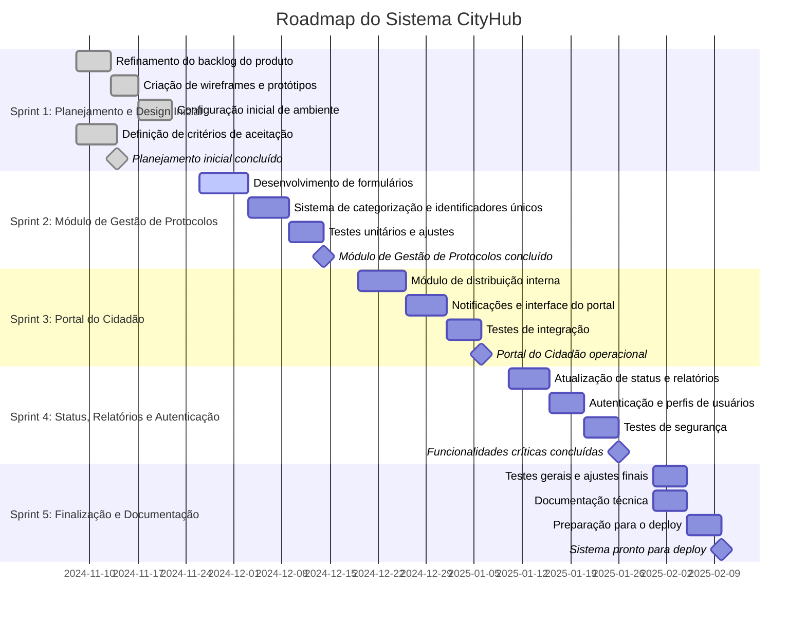

# **Sistemas CityHub**

### **Edilson Gomes & Franciele Fernandes**

# **Controle de Versões do Documento**

| **Versão** | **Data**   | **Autor**           | **Descrição**                                                |
| ---------- | ---------- | ------------------- | ------------------------------------------------------------ |
| 1.0        | 06/11/2024 | Edilson & Franciele | Versão inicial do documento, contendo a estrutura básica e os primeiros tópicos. |
| 1.1        | 08/11/2024 | Edilson & Franciele | Revisão dos requisitos funcionais e inclusão de campos ausentes. |
| 1.2        | 19/11/2024 | Edilson & Franciele | Atualização dos diagramas de caso de uso e MER.              |
| 1.3        | 03/12/2024 | Edilson & Franciele | Inclusão do diagrama de componentes e do gráfico de Gantt.   |
| 1.4        | 16/12/2024 | Edilson & Franciele | Revisão final e adequação do documento conforme feedback da equipe. |

# **Índice do Documento**

1. [Escopo do Produto](#escopo-do-produto)
2. [Escopo do Projeto](#escopo-do-projeto)
3. [Requisitos Funcionais](#requisitos-funcionais)
4. [Requisitos Não Funcionais](#requisitos-não-funcionais)
5. [Regras de Negócio](#regras-de-negócio)
6. [Caso de Uso Descritivo](#caso-de-uso-descritivo)
7. [Diagramas](#diagramas)
   1. [Diagrama de Caso de Uso](#diagrama-de-caso-de-uso)
   2. [Diagrama de Modelo Entidade e Relacionamento (MER)](#diagrama-de-modelo-entidade-e-relacionamento-mer)
   3. [Diagrama de Classe](#diagrama-de-classe)
   4. [Diagrama de EAP (Estrutura Analítica do Projeto)](#diagrama-de-eap-estrutura-analítica-do-projeto)
   5. [Diagrama de Fluxo de Eventos](#diagrama-de-fluxo-de-eventos)
   6. [Diagrama de Componentes](#diagrama-de-componentes)
8. [Gráfico de Gantt](#gráfico-de-gantt)
9. [Estimativas de esforço e custo](#Estimativas-de-esforço-e-custo)

---

## **Escopo do Produto**
**Objetivo:** 
Desenvolver um sistema protocolar que centralize a criação, o acompanhamento e a comunicação de requisições entre cidadãos e os departamentos municipais, promovendo transparência e eficiência no atendimento.

---

### 1. **O que o sistema CityHub vai fazer**

- **Criação e Registro de Protocolos**
  - Permitir que os cidadãos e os funcionários municipais registrem requisições de forma organizada.
  - Disponibilizar um identificador único para cada protocolo gerado.
  - Campos para registro de protocolo:
  
    - Título da requisição (obrigatório, texto de até 100 caracteres)
  Descrição (texto livre para detalhamento da solicitação, até 500 caracteres)
  Categoria (ex.: manutenção de vias, iluminação pública, coleta de lixo)
  Data de abertura (gerada automaticamente)
  Departamento responsável (seleção obrigatória com lista predefinida de departamentos)
  Anexos (opcional, permite upload de arquivos PDF, imagens, etc.).

- **Gestão e Distribuição Interna de Requisições**
  - As requisições serão criadas por um departamento responsável.
  - Permitir atualizações de requisições, quando necessário.
  - Disponibilizar notificações internas para os responsáveis das requisições.

- **Área do Cidadão**
  - Acompanhar o status das requisições em tempo real.
  - Notificar atualizações e mudanças de status das requisições de forma automática.
  - Disponibilizar caixa de comentários para a melhoria das requisições e serviços.

- **Controle de Status e Relatórios**
  - Permitir que o, departamento responsável das requisições, atualize o status dos protocolos (ex.: em análise, em execução, finalizado).

- **Autenticação e Permissões**
  - Autenticação via google para evitar dados desnecessários.
  - Definir privilégio de acesso de acordo com hierarquia de usuário (cidadão, funcionário, administrador).
  
- **Notificações e Alertas**
  - Enviar notificações para a "Área do cidadão" sobre alterações nos status dos seus protocolos.
  - Disponibilizar alertas internos para os departamentos sobre protocolos prioritários ou atrasados.

### 2. **O que o sistema CityHub não vai fazer**

- **Gestão Avançada de Processos**
  - Integração com sistemas de workflow para definir fluxos complexos de requisições.
  - Implementação de automação de processos para tarefas repetitivas, reduzindo o tempo de resposta.

- **Análise e Transparência Pública**
  - Desenvolver painéis com KPIs sobre o atendimento das requisições para auditorias e transparência.
  - Disponibilizar um histórico público das ações executadas por departamento, mantendo a privacidade de dados pessoais.

- **Integrações Externas**
  - Fornecer API pública para integração com outras plataformas de atendimento municipal.
  - Suporte para integração com sistemas de terceiros para notificações e atualizações automáticas.

### Conclusão

O *CityHub* é um sistema corporativo projetado para centralizar e gerenciar protocolos e requisições entre departamentos municipais, garantindo segurança, eficiência e controle no fluxo de informações, com acesso hierárquico e ferramentas de análise para otimizar o atendimento ao cidadão.

------

## **Escopo do Projeto**

#### **Objetivo**
Entregar um sistema protocolar funcional que centralize e gerencie requisições e protocolos entre departamentos municipais, possibilitando o acompanhamento pelo cidadão e integração com setores administrativos.

### **Modelo de Ciclo de Vida Iterativo e Incremental  (com Método Ágil - Scrum)**

#### **Duração Total**: 65 dias  
#### **Sprints**: 5 sprints de 9 dias cada

### **1. Estrutura do Time**

- **Product Owner (PO):** Responsável por priorizar e definir os requisitos e manter backlog atualizado, representando os interesses da Prefeitura.
- **Scrum Master:** Facilita o processo, organiza as reuniões Scrum e remove impedimentos.
- **Time de Desenvolvimento:** Desenvolvedores Full Stack, QA (Quality Assurance), e um UX/UI Designer.
  
### **2. Ferramentas**

- **Gestão de Projetos:**  Com as issues e GitHub Projects (para o gerenciamento de tarefas e acompanhamento do backlog).
- **Versionamento de Código:** Git, GitHub (para controle de versão e integração contínua).
- **Comunicação:** Discord (para troca de informações rápidas).
- **Documentação:** Repositório no GitHub (para documentação técnica e de produto).
- **Automação e Integração Contínua:** GitHub Actions CI/CD (para builds e deploys automáticos).
- **Design e Prototipagem:** Figma (para wireframes e protótipos de interface).

### **3. Backlog do Produto (Principais Épicos e Funcionalidades)**

1. **Gestão de Protocolos:** Registro, atualização, categorização e identificação de requisições.
2. **Distribuição Interna e Escalonamento:** Distribuição automática e manual de requisições.
3. **Área do Cidadão:** Consultas e notificações em tempo real para acompanhamento de requisições.
4. **Controle de Status :** Atualização de requisições e análise de processos.
5. **Autenticação e Permissões:** Integração segura com o sistema da Prefeitura e gerenciamento de privilégio.
6. **Notificações e Alertas:** Notificações automáticas para usuários, funcionários e departamentos.

---

### **4. Roadmap por Sprints**

#### **Sprint 1: Planejamento e Design Inicial**
- **Objetivo:** Definir requisitos detalhados e criar wireframes iniciais para aprovação.
- **Principais Atividades:**
  - Refinamento do backlog do produto com o PO.
  - Criação de wireframes e protótipos do sistema.
  - Configuração inicial de ambiente (servidores, banco de dados, CI/CD).
  - Definição de critérios de aceitação das principais funcionalidades.
- **Reuniões:** Sprint Planning e Daily Scrum.

#### **Sprint 2: Desenvolvimento do Módulo de Gestão de Protocolos**
- **Objetivo:** Implementar o módulo de criação e gestão de protocolos.
- **Principais Atividades:**
  - Desenvolvimento de formulários para registro de requisições.
  - Implementação do sistema de categorização e identificadores únicos.
  - Testes unitários iniciais e ajustes.
- **Reuniões:** Daily Scrum, Sprint Review e Retrospectiva.

#### **Sprint 3: Módulo de Distribuição Interna e Área do Cidadão**
- **Objetivo:** Construir a interface de consulta e acompanhamento para cidadãos.
- **Principais Atividades:**
  - Desenvolvimento do módulo de distribuição interna de requisições.
  - Implementação de notificações e interface do portal do cidadão.
  - Realizar testes de integração para garantir o funcionamento entre os módulos.
- **Reuniões:** Daily Scrum, Sprint Review e Retrospectiva.

#### **Sprint 4: Controle de Status, Relatórios e Autenticação**
- **Objetivo:** Concluir a atualização de status e relatórios e configurar permissões.
- **Principais Atividades:**
  - Implementação da atualização de status e geração de relatórios.
  - Implementação de autenticação e configuração de perfis de usuários.
  - Testes de segurança e validação de permissões.
- **Reuniões:** Daily Scrum, Sprint Review e Retrospectiva.

#### **Sprint 5: Finalização, Testes e Documentação**
- **Objetivo:** Realizar ajustes finais, testes gerais e documentar o sistema.
- **Principais Atividades:**
  - Testes de aceitação e ajuste de última hora.
  - Redação da documentação técnica e do usuário.
  - Preparação para o deploy e treinamento rápido do usuário final (se aplicável).
- **Reuniões:** Daily Scrum, Sprint Review final e Retrospectiva.

---

### **5. Cerimônias Scrum**

- **Sprint Planning** (início de cada sprint): Definição do escopo e tarefas.
- **Daily Scrum** (diário): Revisão do progresso e alinhamento do time.
- **Sprint Review** (final de cada sprint): Demonstração das funcionalidades desenvolvidas.
- **Sprint Retrospective** (final de cada sprint): Avaliação e melhorias para o próximo sprint.

---

### **6. Critérios de Aceitação e Métricas de Sucesso**

- **Funcionalidade Completa:** Todas as funcionalidades devem estar operacionais e testadas.
- **Desempenho:** O sistema deve responder adequadamente em todas as operações.
- **Usabilidade:** Interface intuitiva e fácil de usar.
- **Segurança:** Autenticação robusta e controle de acesso.
- **Documentação:** Manual completo para usuários e documentação técnica.

---

## **Requisitos Funcionais**
| **ID** | **Nome**              | **Descrição**                                                | **Prioridade** | **Dependência** |
| ------ | --------------------- | ------------------------------------------------------------ | -------------- | --------------- |
| RF01   | Cadastrar requisição  | O administrador deve cadastrar as requisições com os seguintes dados: descrição, dataCriação, usuário, departamento, prioridade, statusProcesso. | Alta           | Nenhuma         |
| RF02   | Consultar requisição  | O cidadão e funcionário podem consultar o status de suas requisições, usando o protocolo da requisição desejada no filtro de busca na página Área do cidadão. | Alta           | RF01            |
| RF03   | Atualizar requisição  | O administrador pode editar informações de requisições, se necessárias, deve atualizar os dados:(RF01) + dataAtualização e anexa um comentário da atualização. | Alta           | RF01            |
| RF04   | Comentar requisição   | O cidadão, funcionário e administrador podem comentar as requisições cadastradas, na página Área do cidadão, haverá uma caixa de comentários que após preenchido clica o botão-comentar. | Média          | RF01, RF03      |
| RF05   | Cadastrar funcionário | O administrador pode cadastrar funcionário, com os dados da conta google mais os dados: hierarquia, status e privilégio. | Alta           |                 |

---

## **Requisitos Não Funcionais**
| **ID** | **Descrição**                                                | **Prioridade** | **Dependência** |
| ------ | ------------------------------------------------------------ | -------------- | --------------- |
| RNF01  | O sistema deve permitir a autenticação via conta Google.     | Alta           |                 |
| RNF02  | O sistema deve garantir que os dados de autenticação via Google sejam armazenados de forma segura, em conformidade com as normas de privacidade e segurança. | Alta           |                 |
| RNF03  | O sistema deve notificar automaticamente a página  Área do cidadão após cadastro ou atualização de uma requisição. | Alta           | RF01, RF03      |
| RNF04  | O sistema deve notificar automaticamente, atrasos, vencimentos ou atualização de uma requisição os departamentos envolvidos. | Alta           | RF01, RF03      |
---

## **Regras de Negócio**
| **ID** | **Descrição**                                                | **Prioridade** | **Dependência** |
| ------ | ------------------------------------------------------------ | -------------- | --------------- |
| RN01   | O sistema não permite a exclusão de uma requisição cadastrada, caso a requisição for negada ou executada o sistema automaticamente arquiva a requisição. | Alta           | RF01, RF03      |
| RN02   | O funcionário só poderá cadastrar requisições após completar o cadastro de funcionário realizado pelo administrador, informando seus privilégios. | Alta           | RF05, RNF01     |
| RN03   | O sistema deve verificar se o email do cidadão, funcionário ou administrador está vinculado ao cadastro do sistema antes de permitir o acesso a Área do cidadão. | Alta           | RNF01           |
| RN04   | O cidadão só poderá visualizar a área do cidadão e fazer comentários nas requisições atribuida a ele | Alta           | RNF02, RNF04    |
| RN05   | Cada requisição no CityHub recebe uma prioridade automática com base no departamento responsável. As prioridades seguem esta hierarquia: Alta para Saúde, Segurança Pública e Educação; Média para Obras, Assistência Social e Meio Ambiente; e Baixa para Cultura, Esportes e Transporte. Isso garante que solicitações urgentes sejam tratadas primeiro, enquanto as demais seguem um fluxo organizado.  | Alta           | RNF02, RNF04    |
---

## **Caso de Uso Descritivo**
### Caso de Uso: Cadastrar Requisição

| **ID**                | RF01                                                         |
| --------------------- | ------------------------------------------------------------ |
| **Nome**              | Cadastrar requisição                                         |
| **Ator**              | Administrador                                                |
| **Fluxo Principal**   | 1. O administrador acessa o sistema e escolhe a opção de cadastrar requisição. |
|                       | 2. O administrador preenche os campos obrigatórios: descrição, dataCriação, usuário, |
|                       | departamento, prioridade, e statusProcesso.                  |
|                       | 3. O sistema valida as informações fornecidas.               |
|                       | 4. O sistema salva a requisição no banco de dados e retorna uma mensagem de sucesso. |
| **Fluxo Alternativo** | 1a. Caso algum campo obrigatório não seja preenchido ou inválido: |
|                       | - O sistema exibe uma mensagem de erro, informando os campos que precisam ser corrigidos. |
| **Critérios**         | - Todos os campos obrigatórios devem ser preenchidos corretamente. |
|                       | - A data de criação deve ser gerada automaticamente no momento do cadastro. |

---

### Caso de Uso: Consultar Requisição

| **ID**                | RF02                                                         |
| --------------------- | ------------------------------------------------------------ |
| **Nome**              | Consultar requisição                                         |
| **Ator**              | Cidadão, Funcionário                                         |
| **Fluxo Principal**   | 1. O usuário acessa a página *Área do Cidadão*.              |
|                       | 2. O usuário insere o protocolo da requisição no campo de busca. |
|                       | 3. O sistema valida o protocolo inserido.                    |
|                       | 4. O sistema exibe o status e os detalhes da requisição correspondente. |
| **Fluxo Alternativo** | 1a. Caso o protocolo seja inválido ou não exista:            |
|                       | - O sistema exibe uma mensagem informando que nenhuma requisição foi encontrada. |
| **Critérios**         | - O usuário deve inserir um protocolo válido.                |

---

### Caso de Uso: Atualizar Requisição

| **ID**                | RF03                                                         |
| --------------------- | ------------------------------------------------------------ |
| **Nome**              | Atualizar requisição                                         |
| **Ator**              | Administrador                                                |
| **Fluxo Principal**   | 1. O administrador acessa o sistema e escolhe a opção de atualizar requisição. |
|                       | 2. O administrador seleciona a requisição desejada para edição. |
|                       | 3. O administrador altera os dados necessários e insere a dataAtualização e um comentário. |
|                       | 4. O sistema valida e salva as alterações realizadas.        |
| **Fluxo Alternativo** | 1a. Caso algum campo obrigatório não seja preenchido ou inválido: |
|                       | - O sistema exibe uma mensagem de erro, informando os campos que precisam ser corrigidos. |
| **Critérios**         | - A dataAtualização deve ser gerada automaticamente ou informada pelo administrador. |
|                       | - É necessário adicionar um comentário justificando a alteração. |

---

### Caso de Uso: Comentar Requisição

| **ID**                | RF04                                                         |
| --------------------- | ------------------------------------------------------------ |
| **Nome**              | Comentar requisição                                          |
| **Ator**              | Cidadão, Funcionário, Administrador                          |
| **Fluxo Principal**   | 1. O usuário acessa a página *Área do Cidadão*.              |
|                       | 2. O usuário seleciona a requisição desejada.                |
|                       | 3. O usuário insere o comentário na caixa de texto e clica no botão de comentar. |
|                       | 4. O sistema valida e salva o comentário vinculado à requisição. |
| **Fluxo Alternativo** | 1a. Caso o comentário esteja vazio:                          |
|                       | - O sistema exibe uma mensagem informando que o campo comentário não pode estar vazio. |
| **Critérios**         | - O comentário deve ser vinculado à requisição correta e salvo com a identificação do autor. |

---

### Caso de Uso: Cadastrar Funcionário

| **ID**                | RF05                                                         |
| --------------------- | ------------------------------------------------------------ |
| **Nome**              | Cadastrar funcionário                                        |
| **Ator**              | Administrador                                                |
| **Fluxo Principal**   | 1. O administrador acessa o sistema e escolhe a opção de cadastrar funcionário. |
|                       | 2. O administrador insere os dados necessários: conta Google, hierarquia, status e privilégio. |
|                       | 3. O sistema valida as informações fornecidas.               |
|                       | 4. O sistema salva os dados do funcionário no banco de dados e retorna uma mensagem de sucesso. |
| **Fluxo Alternativo** | 1a. Caso algum campo obrigatório não seja preenchido ou inválido: |
|                       | - O sistema exibe uma mensagem de erro, informando os campos que precisam ser corrigidos. |
| **Critérios**         | - Os dados do funcionário devem ser armazenados com os níveis de privilégio adequados. |

## **Diagramas**

### **Diagrama de Caso de Uso**

*Legenda: Diagrama de Caso de Uso do sistema.*

### **Diagrama de Modelo Entidade e Relacionamento (MER)**

*Legenda: Modelo Entidade-Relacionamento, representando as entidades e os relacionamentos do sistema.*

### **Diagrama de Classe**

*Legenda: Diagrama de Classes, mostrando as principais classes do sistema e seus atributos.*

### **Diagrama de Fluxo de Eventos**

*Legenda: Diagrama de Fluxo de Eventos, ilustrando o fluxo de eventos dentro do sistema.*

### **Diagrama de Componentes**

*Legenda: Diagrama de Componentes, detalhando os componentes do sistema e suas interações.*

### **Diagrama de EAP (Estrutura Analítica do Projeto)**

*Legenda: Diagrama de EAP, ilustrando a estrutura analítica do projeto, com suas divisões e entregas.*

## **Gráfico de Gantt**

## Estimativas de esforço e custo

### Taxas específicas de custos, papéis principais envolvidos em cada tarefa:

- **Desenvolvedor**: R$ 18/h
- **Testador**: R$ 14/h
- **Analista de Negócios**: R$ 22/h

### Distribuição aproximada do esforço por papel para cada tarefa:

- **Planejamento e design**: 80% analista, 20% desenvolvedor.
- **Desenvolvimento**: 90% desenvolvedor, 10% testador.
- **Testes**: 100% testador.
- **Documentação e ajustes**: 60% analista, 40% desenvolvedor.

### Estimativa de esforço e custo:

| Sprint                                      | Tarefa                                            | Esforço (horas) | Custo (R$)                  |
| ------------------------------------------- | ------------------------------------------------- | --------------- | --------------------------- |
| Sprint 1: Planejamento e Design Inicial     | Refinamento do backlog do produto                 | 40              | 704 (80% analista, 20% dev) |
|                                             | Criação de wireframes e protótipos                | 32              | 563 (80% analista, 20% dev) |
|                                             | Configuração inicial de ambiente                  | 40              | 720 (100% dev)              |
|                                             | Definição de critérios de aceitação               | 48              | 845 (80% analista, 20% dev) |
|                                             | **Subtotal Sprint 1**                             | 160             | **R$ 2.832**                |
| Sprint 2: Módulo de Gestão de Protocolos    | Desenvolvimento de formulários                    | 56              | 1.008 (90% dev, 10% test)   |
|                                             | Sistema de categorização e identificadores únicos | 48              | 864 (90% dev, 10% test)     |
|                                             | Testes unitários e ajustes                        | 40              | 560 (100% test)             |
|                                             | **Subtotal Sprint 2**                             | 144             | **R$ 2.432**                |
| Sprint 3: Portal do Cidadão                 | Módulo de distribuição interna                    | 56              | 1.008 (90% dev, 10% test)   |
|                                             | Notificações e interface do portal                | 48              | 864 (90% dev, 10% test)     |
|                                             | Testes de integração                              | 40              | 560 (100% test)             |
|                                             | **Subtotal Sprint 3**                             | 144             | **R$ 2.432**                |
| Sprint 4: Status, Relatórios e Autenticação | Atualização de status e relatórios                | 48              | 844 (80% analista, 20% dev) |
|                                             | Autenticação e perfis de usuários                 | 40              | 720 (100% dev)              |
|                                             | Testes de segurança                               | 40              | 560 (100% test)             |
|                                             | **Subtotal Sprint 4**                             | 128             | **R$ 2.124**                |
| Sprint 5: Finalização e Documentação        | Testes gerais e ajustes finais                    | 40              | 560 (100% test)             |
|                                             | Documentação técnica                              | 40              | 704 (60% analista, 40% dev) |
|                                             | Preparação para o deploy                          | 40              | 720 (100% dev)              |
|                                             | **Subtotal Sprint 5**                             | 120             | **R$ 1.984**                |
| **TOTAL GERAL**                             |                                                   | 696 horas       | **R$ 11.804**               |

---

### Distribuição dos custos por papel:

- **Desenvolvedor (R$ 18/h)**: R$ 7.200 (400 horas).
- **Testador (R$ 14/h)**: R$ 2.380 (170 horas).
- **Analista de Negócios (R$ 22/h)**: R$ 2.224 (126 horas).

**Divisão das atividades e custos para cada papel.**