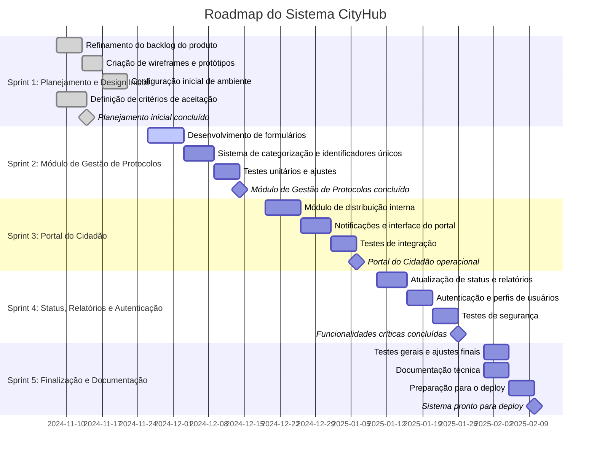

```mermaid
gantt
    title Roadmap do Sistema CityHub
    dateFormat  YYYY-MM-DD

section Sprint 1: Planejamento e Design Inicial
    Refinamento do backlog do produto         :done, a1, 2024-11-08, 5d
    Criação de wireframes e protótipos        :done, a2, after a1, 4d
    Configuração inicial de ambiente          :done, a3, after a2, 5d
    Definição de critérios de aceitação       :done, a4, 2024-11-08, 6d
    Planejamento inicial concluído            :done, milestone, a5, after a4, 0d

section Sprint 2: Módulo de Gestão de Protocolos
    Desenvolvimento de formulários            :active, b1, 2024-11-26, 7d
    Sistema de categorização e identificadores únicos :b2, after b1, 6d
    Testes unitários e ajustes                :b3, after b2, 5d
    Módulo de Gestão de Protocolos concluído  :milestone, b4, after b3, 0d
    
section Sprint 3: Portal do Cidadão
    Módulo de distribuição interna            :c1, 2024-12-19, 7d
    Notificações e interface do portal        :c2, after c1, 6d
    Testes de integração                      :c3, after c2, 5d
    Portal do Cidadão operacional             :milestone, c4, after c3, 0d

section Sprint 4: Status, Relatórios e Autenticação
    Atualização de status e relatórios        :d1, 2025-01-10, 6d
    Autenticação e perfis de usuários         :d2, after d1, 5d
    Testes de segurança                       :d3, after d2, 5d
    Funcionalidades críticas concluídas       :milestone, d4, after d3, 0d

section Sprint 5: Finalização e Documentação
    Testes gerais e ajustes finais            :e1, 2025-01-31, 5d
    Documentação técnica                      :e2, 2025-01-31, 5d
    Preparação para o deploy                  :e3, after e1, 5d
    Sistema pronto para deploy                :milestone, e4, after e3, 0d
```

