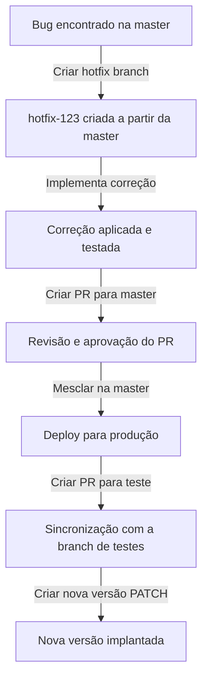

# Plano de Mudança - Fluxo de Git

## Objetivo

Este documento descreve o plano de mudança para gerenciamento de código no repositório, seguindo o fluxo de trabalho baseado nas branches `master` e `teste`. Todas as **issues** do Git geram novas branches, que devem ser integradas na branch `teste` antes de serem mescladas na `master`.

## Fluxo de Trabalho

### 1. **Criação de Branch**

- **Branch Principal**: `master` (produtiva, versão estável do código).
- **Branch de Teste**: `teste` (utilizada para desenvolvimento e integração das features).
- **Branches de Issue**: Para cada issue criada no Git, uma nova branch será gerada a partir de `teste`. A nomenclatura das branches será baseada no ID da issue:
  - `issue-<ID-da-issue>` (por exemplo, `issue-123` ou `issue-456`).

#### Exemplo de criação de branch:

```bash
git checkout teste
git checkout -b issue-123
```

## 2. Processo de Gerenciamento e Controle de Mudanças

### **Branches**

- `master`: Contém a versão estável do sistema.
- `teste`: Ambiente de integração de features antes de serem aprovadas para produção.
- `hotfix-<ID>`: Usada para correções urgentes em produção.
- `issue-<ID>`: Criada a partir da branch `teste` para desenvolvimento de novas funcionalidades ou correções.

### **Pull Request e Code Review**

1. O desenvolvedor cria um **Pull Request (PR)** da branch `issue-<ID>` para `teste`.
2. O PR é revisado por pelo menos um outro desenvolvedor.
3. Se aprovado, é mesclado na branch `teste`.
4. Testes são realizados e, se tudo estiver correto, é criado um novo PR para `master`.

### **Versionamento Semântico**

Adotamos o padrão **SemVer (Semantic Versioning)**:

- `MAJOR`: Mudanças incompatíveis na API.
- `MINOR`: Novas funcionalidades adicionadas de forma retrocompatível.
- `PATCH`: Correção de bugs e pequenas melhorias.

Exemplo de versão:

```plaintext
1.2.3  (MAJOR.MINOR.PATCH)
```

## 3. Fluxo de Correção de Bug em Produção

Quando um bug é identificado na branch `master`, o seguinte fluxo é seguido:

1. Criar uma nova branch `hotfix-<ID>` a partir de `master`.
2. Implementar a correção e realizar testes.
3. Criar um PR da `hotfix-<ID>` para `master`.
4. Revisar e aprovar o PR.
5. Mesclar a correção na `master`.
6. Criar um PR para mesclar a `hotfix-<ID>` na `teste` para manter as branches sincronizadas.
7. Criar uma nova versão PATCH (ex: 1.2.4 -> 1.2.5).
8. Gerar um novo deploy para produção.

### **Diagrama do Fluxo (Mermaid)**




