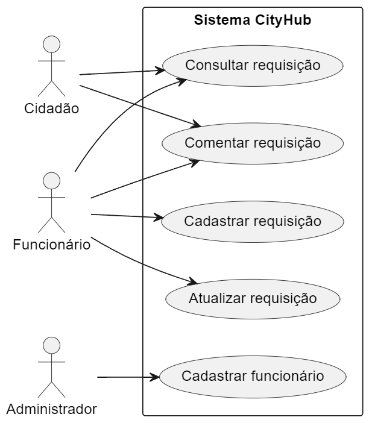

*Edilson Gomes*  
*Franciele Fernandes*  

# SISTEMA DE PROTOCOLO PARA PREFEITURAS - CITYHUB  

**Objetivo:** Desenvolver um sistema protocolar que centralize a criação, o acompanhamento e a comunicação de requisições entre cidadãos e os departamentos municipais, promovendo transparência e eficiência no atendimento.  

## Diagrama Caso de Uso  
 

### PLANEJAMENTO DE TESTE DE CENÁRIO

Aqui descreve os caso de uso que serão testados suas funcionalidades como: validação, campos obrigatórios, persistência de dados e etc.

### 1. Teste de Cenário: Cadastrar Requisição (Funcionário)
- **Pré-condições:**
  - Usuário logado como funcionário.
  - Campos obrigatórios disponíveis na interface.
- **Ações do Usuário:**
  1. Acessar o formulário de cadastro de requisição.
  2. Preencher os campos obrigatórios corretamente.
  3. Submeter o formulário.
- **Resultado Esperado:**
  - Requisição salva com sucesso no banco de dados.
  - Mensagem de sucesso exibida ao usuário.
  - Registro disponível na lista de requisições.
- **Tipos de Teste:**
  - Teste funcional.
    - O que vai testar? Se tudo funciona direito no fluxo principal: abrir o formulário, preencher, enviar e ver a requisição salva.
  - Teste de validação de campos.
    - O que vai testar? Se o sistema impede que o formulário seja enviado quando algo está errado.
  - Teste de integração com o banco de dados.
    - O que vai testar? Se a requisição está realmente sendo salva no banco de dados.
- **Como vai ser feito?**
  - **Testes manuais:** O testador vai seguir os passos para preencher os campos corretamente e testar.
  - **Banco de Dados:** Vai ser verificado diretamente no banco para ter certeza que os dados estão lá.

### 2. Teste de Cenário: Atualizar Requisição (Funcionário)
- **Pré-condições:**
  - Usuário logado como funcionário.
  - Requisição existente no sistema.
- **Ações do Usuário:**
  1. Selecionar uma requisição existente.
  2. Alterar os campos permitidos.
  3. Salvar as alterações.
- **Resultado Esperado:**
  - Alterações salvas com sucesso no banco de dados.
  - Histórico atualizado com o comentário e data.
  - Mensagem de sucesso exibida.
- **Tipos de Teste:**
  - Teste funcional.
    - O que vai testar? Ver se é possível editar e salvar a requisição sem erro.
  - Teste de fluxo de dados.
    - O que vai testar? Confirmar que os dados foram atualizados no banco e no histórico.
  - Teste de UI/UX.
    - O que vai testar? Garantir que a tela funciona bem e as mensagens são claras.
- **Como vai ser feito?**
  - **Teste Manual:** O testador vai logar como funcionário, editar uma requisição, salvar e verificar se aparece a mensagem de sucesso e os dados foram atualizados.
  - **Banco de Dados:** Editar uma requisição, salvar, e conferir no banco de dados se os novos valores estão corretos. Também verificar se o histórico registrou a mudança com a data.
  - **Interface (UI/UX):** Verificar se o botão Editar funciona, se só os campos permitidos podem ser alterados, e se a mensagem de sucesso aparece clara após salvar.

### 3. Teste de Cenário: Cadastrar Funcionário (Administrador)
- **Pré-condições:**
  - Usuário logado como administrador com permissões adequadas.
  - Dados do novo funcionário disponíveis.
- **Ações do Usuário:**
  1. Acessar a funcionalidade de cadastro de funcionário.
  2. Preencher os dados obrigatórios (e.g., conta Google, hierarquia).
  3. Submeter o formulário.
- **Resultado Esperado:**
  - Novo funcionário registrado no sistema.
  - Dados corretamente armazenados e exibidos.
  - Mensagem de sucesso exibida.
- **Tipos de Teste:**
  - Teste funcional.
    - O que vai testar? Ver se dá para cadastrar o funcionário do começo ao fim, sem erros.
  - Teste de validação de permissões.
    - O que vai testar? Garantir que só administradores têm acesso ao cadastro.
  - Teste de validação de dados.
    - O que vai testar? Verificar se o sistema impede informações erradas, incompletas ou duplicadas.
- **Como vai ser feito?**
  - **Manual:** Um testador vai seguir os passos para preencher os campos obrigatórios e salvar o cadastro.
  - **Banco de Dados:** Conferir se os dados do funcionário foram salvos corretamente.

### 4. Teste de Cenário: Comentar Requisição (Cidadão/Funcionário)
- **Pré-condições:**
  - Requisição existente no sistema.
  - Usuário logado como cidadão ou funcionário.
- **Ações do Usuário:**
  1. Selecionar a requisição desejada.
  2. Inserir comentário na caixa de texto.
  3. Submeter o comentário.
- **Resultado Esperado:**
  - Comentário vinculado à requisição com sucesso.
  - Registro visível no histórico da requisição.
  - Mensagem de sucesso exibida.
- **Tipos de Teste:**
  - Teste funcional.
    - O que vai testar? Ver se o comentário pode ser adicionado do começo ao fim sem problemas.
  - Teste de validação de campos.
    - O que vai testar? Verificar se o sistema impede comentários vazios ou inválidos.
  - Teste de integração com banco de dados.
    - O que vai testar? Confirmar que o comentário está no banco de dados e vinculado à requisição certa.
- **Como vai ser feito?**
  - **Manual:** O testador vai simular o comentário e conferir se tudo funciona.
  - **Banco de Dados:** Conferir diretamente no banco se os dados foram salvos corretamente.

### 5. Teste de Cenário: Consultar Requisição (Cidadão/Funcionário)
- **Pré-condições:**
  - Requisição existente com protocolo válido.
- **Ações do Usuário:**
  1. Inserir o protocolo no campo de busca.
  2. Confirmar a busca.
- **Resultado Esperado:**
  - Se protocolo válido:
    - Status e detalhes da requisição exibidos.
  - Se protocolo inválido:
    - Mensagem de erro: "Protocolo não encontrado".
- **Tipos de Teste:**
  - Teste funcional.
    - O que vai testar? Ver se o sistema exibe os dados corretamente quando o protocolo é válido.
  - Teste de fluxo alternativo (erro).
    - O que vai testar? Garantir que o sistema mostra uma mensagem de erro se o protocolo for inválido.
  - Teste de integração.
    - O que vai testar? Confirmar que os dados da requisição são puxados corretamente do banco de dados.
- **Como vai ser feito?**
  - **Manual:** O testador vai digitar o protocolo e ver se a consulta retorna os dados corretos ou o erro esperado.
  - **Banco de Dados:** Conferir diretamente no banco se as requisições estão lá e se os dados são acessados corretamente.

---

### CENÁRIOS DE TESTE

#### 1. Cadastrar Requisição (Funcionário)

| **CT**   | **Entrada**                                                                          | **Critérios**                                              | **Resultado Esperado**                                   | **Teste**                          | **Cenário de Teste**                                    |
|----------|--------------------------------------------------------------------------------------|-----------------------------------------------------------|-----------------------------------------------------------|------------------------------------|---------------------------------------------------------|
| **CT-001** | Dados válidos: descrição, data, usuário, departamento, prioridade e status preenchidos. | Todos os campos obrigatórios devem estar preenchidos corretamente. | Requisição salva no banco de dados; mensagem de sucesso exibida. | Teste funcional (persistência de banco de dados) | Cadastrar uma requisição com dados válidos. O usuário preenche todos os campos corretamente e a requisição é salva. |
| **CT-002** | Dados inválidos: campo obrigatório vazio ou dados em formato incorreto (ex.: data inválida). | Sistema deve validar os dados e impedir submissão com erro; exibir mensagem clara ao usuário. | Requisição não salva; mensagem de erro exibida informando campos que precisam ser corrigidos. | Teste funcional (validação de campos) | Tentar cadastrar uma requisição com dados inválidos. O sistema impede o envio e exibe erros para campos incorretos ou vazios. |

#### 2. Atualizar Requisição (Funcionário)

| **CT**   | **Entrada**                                                                          | **Critérios**                                              | **Resultado Esperado**                                   | **Teste**                          | **Cenário de Teste**                                    |
|----------|--------------------------------------------------------------------------------------|-----------------------------------------------------------|-----------------------------------------------------------|------------------------------------|---------------------------------------------------------|
| **CT-003** | Selecionar requisição válida e editar campos permitidos com dados corretos.         | Sistema deve permitir edição apenas de campos permitidos; dados devem ser válidos. | Alterações salvas no banco de dados; histórico atualizado; mensagem de sucesso exibida. | Teste funcional (persistência de banco de dados) | Editar uma requisição válida. O usuário edita os campos permitidos com dados corretos, e as mudanças são salvas corretamente. |
| **CT-004** | Selecionar requisição inválida ou tentar editar campos não permitidos.             | Sistema deve bloquear edições de campos não autorizados ou alterações em requisições inexistentes. | Alterações não realizadas; mensagem de erro exibida informando motivo da falha. | Teste funcional (validação de campos) | Tentar editar uma requisição inválida ou campos não permitidos. O sistema bloqueia a edição e exibe mensagem de erro. |

#### 3. Cadastrar Funcionário (Administrador)

| **CT**   | **Entrada**                                                                          | **Critérios**                                              | **Resultado Esperado**                                   | **Teste**                          | **Cenário de Teste**                                    |
|----------|--------------------------------------------------------------------------------------|-----------------------------------------------------------|-----------------------------------------------------------|------------------------------------|---------------------------------------------------------|
| **CT-005** | Dados válidos: conta Google, hierarquia, status e privilégio inseridos corretamente. | Todos os campos obrigatórios devem estar preenchidos corretamente; dados devem ser únicos no sistema. | Novo funcionário registrado no banco de dados; mensagem de sucesso exibida. | Teste funcional (persistência de banco de dados) | Cadastrar um novo funcionário com dados válidos. O administrador preenche todos os campos obrigatórios corretamente e o sistema registra o novo funcionário. |
| **CT-006** | Dados inválidos: conta Google já existente ou hierarquia inválida.                  | Sistema deve validar unicidade de conta Google e integridade dos dados hierárquicos. | Cadastro não realizado; mensagem de erro exibida com descrição clara do problema. | Teste funcional (validação de campos) | Tentar cadastrar um novo funcionário com dados inválidos. O sistema bloqueia o cadastro e exibe mensagens claras sobre o erro, como "Conta Google já registrada" ou "Hierarquia inválida". |

#### 4. Comentar Requisição (Cidadão/Funcionário)

| **CT**   | **Entrada**                                                                          | **Critérios**                                              | **Resultado Esperado**                                   | **Teste**                          | **Cenário de Teste**                                    |
|----------|--------------------------------------------------------------------------------------|-----------------------------------------------------------|-----------------------------------------------------------|------------------------------------|---------------------------------------------------------|
| **CT-007** | Comentário válido inserido na requisição existente.                                 | Sistema deve aceitar comentários apenas em requisições existentes; texto deve ser não vazio. | Comentário salvo no banco de dados e vinculado à requisição; mensagem de sucesso exibida. | Teste funcional (persistência de banco de dados) | Adicionar um comentário válido. O usuário adiciona um comentário não vazio a uma requisição existente, e o sistema salva e exibe o comentário corretamente. |
| **CT-008** | Comentário inválido: requisição inexistente ou texto vazio.                        | Sistema deve impedir envio de comentários inválidos.       | Comentário não salvo; mensagem de erro exibida com informações sobre a falha. | Teste funcional (validação de campos) | Tentar adicionar um comentário inválido. O usuário tenta comentar em uma requisição inexistente ou com texto vazio, e o sistema bloqueia a ação, exibindo a mensagem de erro adequada. |

#### 5. Consultar Requisição (Cidadão/Funcionário)

| **CT**   | **Entrada**                                                                          | **Critérios**                                              | **Resultado Esperado**                                   | **Teste**                          | **Cenário de Teste**                                    |
|----------|--------------------------------------------------------------------------------------|-----------------------------------------------------------|-----------------------------------------------------------|------------------------------------|---------------------------------------------------------|
| **CT-009** | Protocolo válido inserido no campo de busca.                                        | Sistema deve validar o protocolo e exibir os detalhes apenas se for válido. | Detalhes e status da requisição exibidos corretamente. | Teste funcional (persistência de banco de dados) | Buscar uma requisição com protocolo válido. O usuário insere um protocolo válido, e o sistema exibe corretamente os detalhes e status da requisição. |
| **CT-010** | Protocolo inválido ou inexistente inserido no campo de busca.                       | Sistema deve identificar protocolo inválido e exibir mensagem clara. | Mensagem de erro exibida: "Protocolo não encontrado". | Teste funcional (validação de campos) | Tentar buscar uma requisição com protocolo inválido. O usuário insere um protocolo inválido ou inexistente, e o sistema exibe a mensagem de erro "Protocolo não encontrado". |

---

### CASOS DE TESTE DAS TRÊS PRINCIPAIS FUNCIONALIDADES DO SISTEMA

#### Caso de Teste: Cadastrar Requisição - CT-001

| **Dados de Entrada** | **Ações Executadas** | **Resultado Esperado** | **Resultado Obtido** |
|----------------------|----------------------|------------------------|----------------------|
| - Descrição: "Conserto de iluminação pública".  - Usuário: "admin123".  - Departamento: "Infraestrutura".  - Prioridade: "Alta".  - Status: "Em andamento". | 1. O administrador acessa o sistema.  2. Seleciona a opção "Cadastrar Requisição".  3. Preenche os campos obrigatórios com os dados fornecidos.  4. Clica no botão "Salvar". | Requisição salva no banco de dados.  Mensagem de sucesso: "Requisição cadastrada com sucesso".  Data de criação gerada automaticamente. | [A preencher após execução] |

---

#### Caso de Teste: Cadastrar Funcionário - CT-005

| **Dados de Entrada** | **Ações Executadas** | **Resultado Esperado** | **Resultado Obtido** |
|----------------------|----------------------|------------------------|----------------------|
| - Conta Google: "funcionario@gmail.com".  - Hierarquia: "Funcionário".  - Status: "Ativo".  - Privilégio: "Consulta". | 1. O administrador acessa o sistema.  2. Seleciona a opção "Cadastrar Funcionário".  3. Preenche os campos obrigatórios com os dados fornecidos.  4. Clica no botão "Salvar". | Funcionário cadastrado no banco de dados com os níveis de privilégio correspondentes.  Mensagem de sucesso: "Funcionário cadastrado com sucesso". | [A preencher após execução] |

---

#### Caso de Teste: Cadastrar Funcionário - CT-006 (conta existente)

| **Dados de Entrada** | **Ações Executadas** | **Resultado Esperado** | **Resultado Obtido** |
|----------------------|----------------------|------------------------|----------------------|
| - Conta Google: "existente@gmail.com".  - Hierarquia: "Administrador".  - Status: "Ativo".  - Privilégio: "Total". | 1. O administrador acessa o sistema.  2. Seleciona a opção "Cadastrar Funcionário".  3. Insere uma conta Google já cadastrada.  4. Clica no botão "Salvar". | Cadastro não realizado.  Mensagem de erro: "Conta Google já existente no sistema". | [A preencher após execução] |

---

#### Caso de Teste: Consultar Requisição - CT-009

| **Dados de Entrada** | **Ações Executadas** | **Resultado Esperado** | **Resultado Obtido** |
|----------------------|----------------------|------------------------|----------------------|
| - Protocolo: "REQ123456". | 1. O usuário acessa a página "Área do Cidadão".  2. Insere o protocolo válido "REQ123456" no campo de busca.  3. Clica no botão "Consultar". | O sistema exibe os detalhes e o status da requisição correspondente ao protocolo "REQ123456". | [A preencher após execução] |

---

#### Caso de Teste: Consultar Requisição - CT-010 (requisição inexistente)

| **Dados de Entrada** | **Ações Executadas** | **Resultado Esperado** | **Resultado Obtido** |
|----------------------|----------------------|------------------------|----------------------|
| - Protocolo: "REQINVALIDO". | 1. O usuário acessa a página "Área do Cidadão".  2. Insere o protocolo inválido "REQINVALIDO" no campo de busca.  3. Clica no botão "Consultar". | O sistema exibe a mensagem de erro: "Protocolo não encontrado". | [A preencher após execução] |

---

